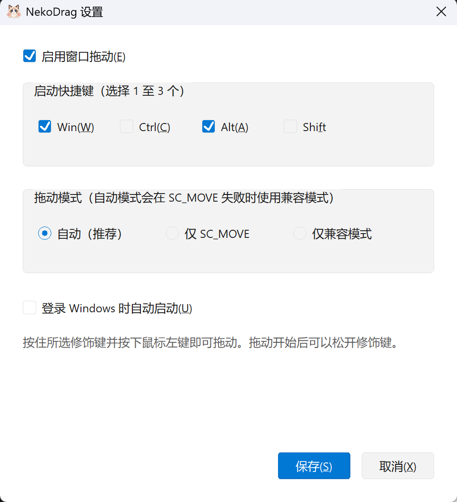

<div align="center">


# NekoDrag

**轻量的 Windows 窗口拖动工具 —— 按住修饰键，从窗口任意位置拖动**

[](https://github.com/CodingLink/NekoDrag/actions/workflows/release.yml)
[](https://github.com/CodingLink/NekoDrag/releases)
[](https://github.com/CodingLink/NekoDrag/tags)
[](https://github.com/CodingLink/NekoDrag)

**[中文](#中文) · [English](#english)**

</div>

---

<a id="中文"></a>
## 中文

NekoDrag 是一个原生 C++17/Win32 实现的 Windows 10/11 x64 托盘程序。按住所选修饰键（默认 `Win+Alt`），即可在普通窗口的任意位置按住鼠标左键拖动窗口，无需瞄准标题栏。

### 目录

- [功能特性](#功能特性)
- [下载](#下载)
- [使用方法](#使用方法)
- [从源码构建](#从源码构建)
- [已知限制](#已知限制)

### 功能特性

**核心拖动**

- 默认 `Win+Alt` + 鼠标左键，在窗口任意位置启动拖动
- Win、Ctrl、Alt、Shift 中任选 1–3 个修饰键，精确匹配（多按不触发）
- 拖动开始后可提前松开修饰键，释放左键才结束
- 支持从后台窗口直接开始拖动并将其激活
- 拖动最大化窗口时自动恢复原始尺寸

**拖动引擎**

- 三种可选模式：**兼容模式（推荐）** / **自动模式（实验）** / **原生模式（诊断）**
- 新安装默认使用兼容模式；已保存的合法模式保持不变
- 自动模式优先尝试实验性 Windows 原生移动循环，原生启动失败时回退到兼容模式；对 Chromium 窗口（Edge/Chrome/Electron 等自绘框架）则跳过原生尝试、直接走兼容拖动
- 自动/仅原生模式会放行真实鼠标按下以建立 Windows 按键状态，并在首次移动时用 `WM_CANCELMODE` 尽力取消控件交互；控件仍可能发生焦点或选择变化
- 最大化窗口会在原生派发前按鼠标相对位置恢复；正常完成保持恢复状态，Esc 或仅原生启动失败会重新最大化
- 成功进入原生移动循环时，Snap 贴靠、跨屏 DPI 和 Esc 取消由 Windows 处理；不保证所有第三方窗口都支持该路径
- 兼容模式使用 `SetWindowPos` 跟随鼠标，不提供系统 Snap、跨屏 DPI 重算或 Esc 回滚语义
- 实现细节见 [技术概述](docs/TECHNICAL_OVERVIEW.md)

**轻量便携**

- 无 .NET、无第三方运行时，静态 MSVC 运行时，单个便携 EXE
- 普通用户权限运行，不请求 UAC
- 设置保存在 `HKCU\Software\NekoDrag`

### 下载

从 [GitHub Releases](https://github.com/CodingLink/NekoDrag/releases) 下载最新的 `NekoDrag-*-windows-x64.zip`，解压后即可直接运行，无需安装。

每个 zip 附带 `.sha256` 校验文件，可在 PowerShell 中验证：

```powershell
Get-FileHash .\NekoDrag-*-windows-x64.zip -Algorithm SHA256
```

> 程序未签名，Windows SmartScreen 可能对未知发布者显示提示，选择"仍要运行"即可。

### 使用方法

<div align="center">



</div>

1. 首次运行 `NekoDrag.exe`，在设置窗口中确认快捷键和拖动模式。
2. 按住所选修饰键，在目标窗口任意位置按住鼠标左键并移动。
3. 拖动开始后可以先松开修饰键；释放鼠标左键后结束拖动。
4. 通过托盘菜单暂停功能、修改设置、启用开机启动或退出。

只有配置中选中的修饰键被按下时才会启动拖动。例如配置 `Win+Alt` 后，同时按住 `Shift` 不会触发。

### 从源码构建

需要 Visual Studio 2026（或 2022），安装"使用 C++ 的桌面开发"和 CMake 组件：

```powershell
cmake -S . -B build -G "Visual Studio 18 2026" -A x64 -DBUILD_TESTING=ON
cmake --build build --config Release --parallel
ctest --test-dir build -C Release --output-on-failure
```

使用 Visual Studio 2022 时改为 `-G "Visual Studio 17 2022"`。

生成的便携程序位于 `build\Release\NekoDrag.exe`，Release 配置使用静态 MSVC 运行时，无需随程序分发额外 DLL。

- **诊断构建**：加 `-DNEKODRAG_TRACE=ON`，拖动状态转换通过 `OutputDebugString` 输出，可用 DebugView 抓取。
- **注意**：旧构建目录含有原仓库的绝对路径，仓库改名后请使用全新的空构建目录。

### 已知限制

- 不控制管理员权限窗口、受保护窗口、安全桌面或 UAC 提示。
- 不保证兼容独占全屏游戏及带有反作弊输入保护的软件。
- 移动 EXE 后，直接运行一次即可刷新已启用的开机启动路径。

---

<a id="english"></a>
## English

NekoDrag is a lightweight Windows 10/11 x64 tray utility written in native C++17/Win32. Hold your chosen modifier keys (`Win+Alt` by default) and drag any normal window from anywhere inside it with the left mouse button — no need to aim for the title bar.

### Contents

- [Features](#features)
- [Download](#download)
- [Usage](#usage)
- [Build from source](#build-from-source)
- [Known limitations](#known-limitations)

### Features

**Core dragging**

- Drag windows from anywhere with `Win+Alt` + left mouse button by default
- Pick any 1–3 of Win, Ctrl, Alt, Shift as modifiers; matched exactly (extra keys don't trigger)
- Modifiers can be released once the drag starts; it ends when the left button is released
- Start dragging from background windows and activate them
- Maximized windows are automatically restored when dragged

**Drag engine**

- Three selectable modes: **Compatibility (recommended)** / **Auto (experimental)** / **Native only (diagnostic)**
- New installations default to compatibility mode; existing valid saved modes are preserved
- Auto first tries the experimental native Windows move loop and falls back to compatibility mode if native startup fails
- Auto/native-only forwards the real mouse press to establish Windows button state, then uses best-effort `WM_CANCELMODE` cleanup on first movement; controls may still change focus or selection
- Maximized windows are restored around the pointer before native dispatch; normal completion keeps them restored, while Esc or native-only startup failure maximizes them again
- When the native move loop starts successfully, Windows handles Snap, multi-monitor DPI, and Esc cancellation; this path is not supported by every third-party window
- Compatibility mode follows the pointer with `SetWindowPos`; it does not provide system Snap, cross-monitor DPI recalculation, or Esc rollback semantics
- See the [technical overview](docs/TECHNICAL_OVERVIEW.md) for implementation details

**Lightweight and portable**

- No .NET, no third-party runtimes — a single portable EXE with the MSVC runtime statically linked
- Runs with standard user privileges; never requests UAC elevation
- Settings stored under `HKCU\Software\NekoDrag`

### Download

Grab the latest `NekoDrag-*-windows-x64.zip` from [GitHub Releases](https://github.com/CodingLink/NekoDrag/releases), extract it, and run — no installation required.

Each zip ships with a `.sha256` checksum file. Verify in PowerShell:

```powershell
Get-FileHash .\NekoDrag-*-windows-x64.zip -Algorithm SHA256
```

> The binary is unsigned, so Windows SmartScreen may warn about an unknown publisher — choose "Run anyway".

### Usage

<div align="center">


</div>

1. Run `NekoDrag.exe`; on first launch, confirm the hotkeys and drag mode in the settings window.
2. Hold the configured modifiers, then hold the left mouse button anywhere on the target window and move.
3. Modifiers can be released once the drag starts; releasing the left button ends it.
4. Use the tray menu to pause, change settings, toggle launch at logon, or quit.

A drag only starts when exactly the configured modifiers are held. With `Win+Alt` configured, also holding `Shift` will not trigger it.

### Build from source

Requires Visual Studio 2026 (or 2022) with the "Desktop development with C++" workload and CMake:

```powershell
cmake -S . -B build -G "Visual Studio 18 2026" -A x64 -DBUILD_TESTING=ON
cmake --build build --config Release --parallel
ctest --test-dir build -C Release --output-on-failure
```

For Visual Studio 2022, use `-G "Visual Studio 17 2022"` instead.

The portable binary is produced at `build\Release\NekoDrag.exe`. Release builds link the MSVC runtime statically, so no extra DLLs need to ship with the program.

- **Diagnostic build**: add `-DNEKODRAG_TRACE=ON` to log drag state transitions via `OutputDebugString` (capture with DebugView).
- **Note**: old build directories contain absolute paths of the previous repository location — use a fresh, empty build directory after renaming.

### Known limitations

- Does not control elevated/protected windows, secure desktops, or UAC prompts.
- Not guaranteed to work with exclusive-fullscreen games or software with anti-cheat input protection.
- After moving the EXE, run it once to refresh the launch-at-logon path.
